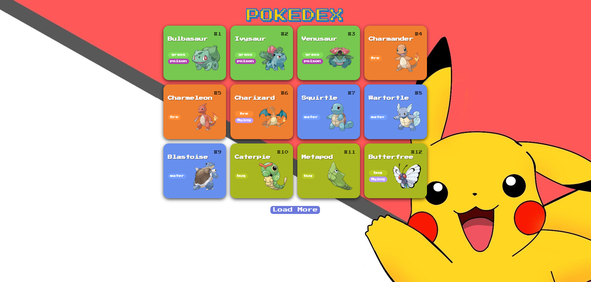

# 🧿 Pokédex Interativa

Bem-vindo à minha Pokédex, um projeto desenvolvido com HTML, CSS e JavaScript puro, consumindo dados da [PokéAPI](https://pokeapi.co/).  
Este projeto faz parte do meu aprendizado e prática de manipulação de DOM, requisições assíncronas, estilização e responsividade no Front-End.

---
## 🚀 Deploy

> Você pode ver a versão online em:  
[🔗 https://matheus97px.github.io/Pokedex/](https://matheus97px.github.io/Pokedex/)

---

---

## 📸 Preview

---

## 🎯 Funcionalidades

- 🔍 Lista paginada de Pokémon com número, nome, tipo e imagem
- 📑 Modal com detalhes:
  - Altura, peso, habilidades
  - Estatísticas com barra de progresso
  - Tipos com cor personalizada
- 🌀 Abas no modal:
  - `About`
  - `Stats`
  - `Moves` (ataques conhecidos)
  - `Evolutions` com imagem e nome
- 📱 Responsivo para mobile e desktop
- 🎨 Estilo inspirado na identidade visual do universo Pokémon

---

## 🧪 Tecnologias Utilizadas

- HTML5
- CSS3 (Flexbox + Grid + Media Queries)
- JavaScript (ES6+)
- Fetch API
- PokéAPI

---

## ✨ Próximos passos

- ✅ Melhorar responsividade geral (já feito)
- 🔄 Adicionar busca por nome ou número
- 🧪 Adicionar filtros por tipo (Ex: só Fire, Water)
- 💾 Salvar favoritos localmente com LocalStorage
- 🌐 Publicar no GitHub Pages

---
## 📌 Créditos

- Dados fornecidos pela [PokéAPI](https://pokeapi.co/)
- Ícones e fontes inspirados no universo Pokémon
- Background: fanart utilizada apenas para fins de estudo

---
## 👨‍💻 Autor

Feito com dedicação por **Matheus PX** 🧙‍♂️  
[🔗 LinkedIn](https://www.linkedin.com/in/matheuspx97/) | [📧 E-mail](mailto:matheus97p.q@gmail.com)
